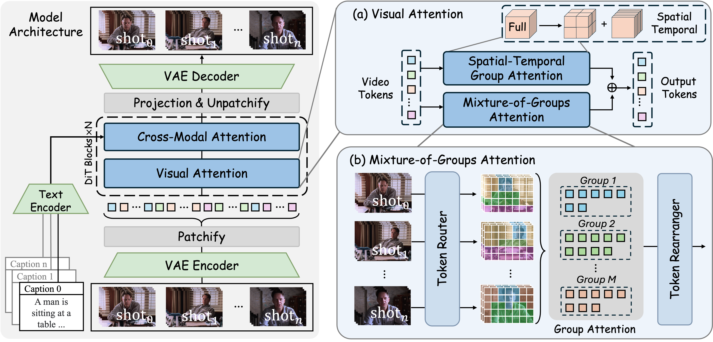
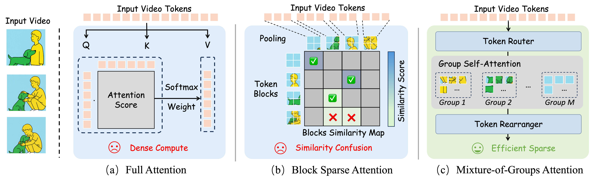

<h3 align="center">
    MoGA: Mixture-of-Groups Attention for End-to-End Long Video Generation
</h3>

 

>
 Weinan Jia, Yuning Lu+, Mengqi Huang  Hualiang Wang, Binyuan Huang, Nan Chen, Mu Liu, Jidong Jiang, Zhendong Mao+</a>  

## 🔥 News
- [10/22/2025] 🔥 The arXiv [paper](https://arxiv.org/pdf/2510.18692) of MoGA is released.
- [10/22/2025] 🔥 The [project page](https://jiawn-creator.github.io/mixture-of-groups-attention/) of MoGA is created.

## 📖 Introduction

We introduce <b>MoGA</b>, an efficient sparse attention for end-to-end long video generation. The overall architecture is shown above.

Through semantic-aware routing, MoGA enables effective long-range interactions. As a kernel-free method, MoGA integrates seamlessly with modern attention stacks, including FlashAttention and sequence parallelism. Building on MoGA, we develop an efficient long video generation model that end-to-end produces minute-level, multi-shot, 480p videos at 24 fps, with a context length of approximately 580k. Comprehensive experiments on various video generation tasks validate the effectiveness of our approach.

## 🚀 Updates
To support research and the open-source community, we will release the entire project—including inference pipelines, and model weights. Thank you for your patience and continued support! 🌟
- [x] Release arXiv paper
- [x] Release GitHub repo
- [ ] Release inference code
- [ ] Release model checkpoints
